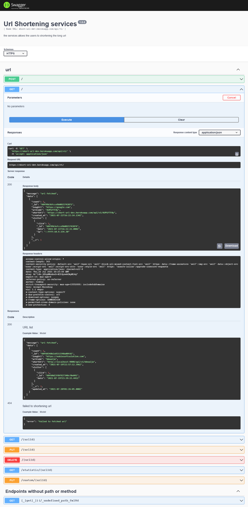

# Shortening URL APP [](https://github.com/abduljeleelng/shortening-url#readme)
> App to shortening URL, developed with Nodejs, Express, MongoDB with the help of mongoose

The guild to use the App.

## Installation

Use need [NodeJS](https://nodejs.org/) to use this, clone the repo and install the dependencies.
```bash
https://github.com/abduljeleelng/shortening-url.git
```
Install the dependencies 

```bash
npm i
```
# set your environmental variable 
```bash
# default DB URI if 'NODE_ENV' not set 
MONGO_URI=mongodb://127.0.0.1:27017/short-url

# DB URI for production server  
MONGO_PRO=

# DB URI for testing - to mockup data
MONGO_TEST=mongodb://127.0.0.1:27017/short-test

# DB URI for dev environment
MONGO_DEV=mongodb://127.0.0.1:27017/short-dev

# App Port
PORT=9000

# This variable "must" set when we want to run "test" 
# 'dev' for dev environment 
# 'pro' for dev production 
# 'test' for test environment, This must set to run test and mock with mongo schema 
NODE_ENV=dev

# The domain  
BASE_URL=

```
Run the development version of the App 

```bash
npm run dev
```
Run Automated test 

```
npm run test
```

Build for production 
```bash
npm run build
```
Start the application 

```bash
npm start
```

## Live Endpoint 
[Shortening-URL](https://short-url-dev.herokuapp.com/api/v1)

## Documentation
[Documentation](https://short-url-dev.herokuapp.com/api/v1/doc/)



## Contact Me
[AbduljeleelNG](maitlto:abduljeleelng@gmail.com)

